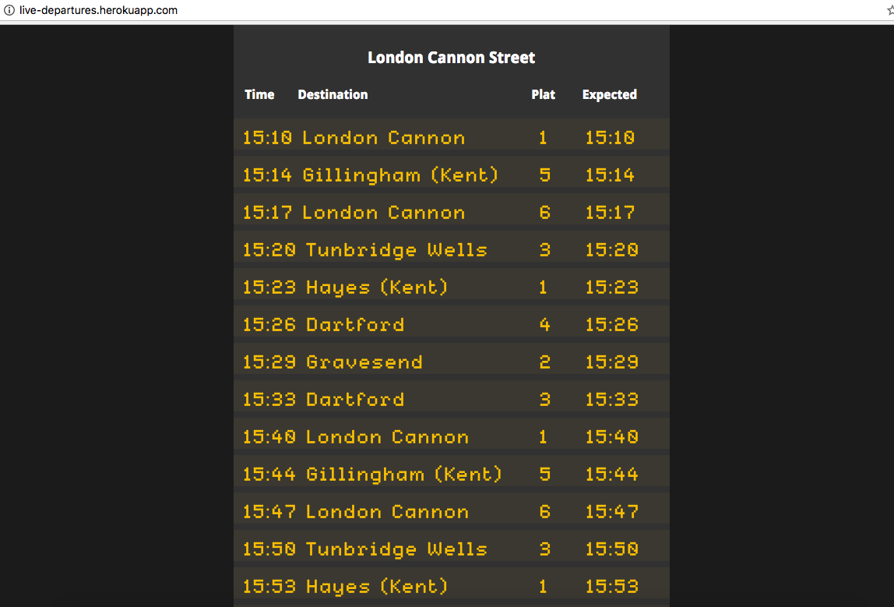

## LIVE DEPARTURE BOARD

A live departure board built with React JS. A web app built in 3,5 days as a team of 4, following XP values and Agile methodology.

We're on heroku: http://live-departures.herokuapp.com



Contributors:

Yulia: https://github.com/chuk-chuk

Artemis:  https://github.com/artemisxen

Kat: https://github.com/kitkat119

### Technology stack
* React JS
* Node JS
* Express
* HTML, CSS
* Transport API

### Setup

- $ git clone git@github.com:oleglukyanov/react-departure-board.git
- $ cd react-departure-board
- $ npm install  
- $ cd react-backend/client
- $ npm start  
- $ visit http://localhost:3000/

### User stories

```
As a user,
So that I can keep an eye on the departures board,
I need to be able to see the departures information for my station

As a user,
so that I can find my train,
i want to be able to see train departure time, destination and platform

As a user,
So that I won't miss my train,
I want the information to update regularly  with live information


As a user,
so that I can see the departures for a particular station,
I want to be able to select a station


As a user,
so that I can seethe departure information for the station closest to me,
i want to be able to opt for station selection by geolocation


```

### Architecture

**Client:**
* Node
* React

**Server:**
* Node
* Express
